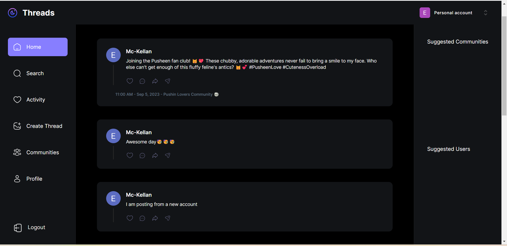
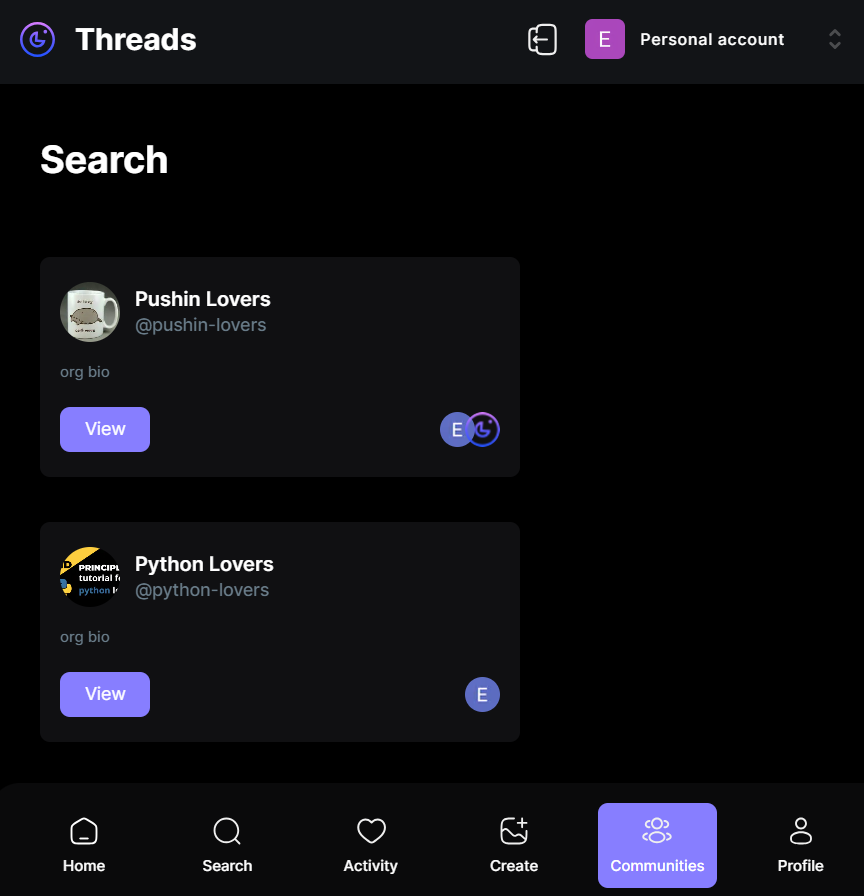
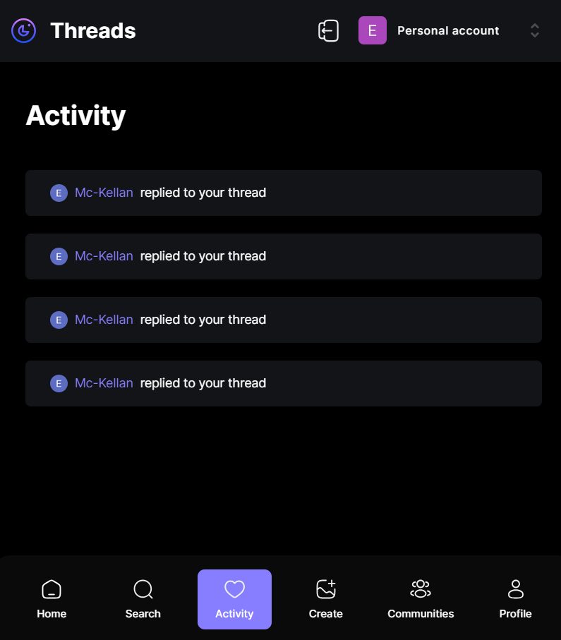

Threads is a feature-rich social networking application built on Next.js 13. It combines the best aspects of Twitter with enhanced community management capabilities. With Threads, you can create and manage communities, invite members via email through Clerk authentication, and enjoy various other features to enhance your social experience.

## Features

- **Server-Side Rendering**: Threads is powered by Next.js 13.4, providing efficient server-side rendering for improved performance and SEO optimization.

- **Community Creation**: Easily create and manage communities within Threads, allowing users to engage in specific topics and discussions.

- **Invitations via Email**: Utilize Clerk for authentication and invite people to join your communities via email, making onboarding simple and secure.

- **Beautiful Layouts**: Create visually appealing layouts using TailwindCSS, enhancing the user experience and **fully responsive ui**.

- **File Uploads**: Seamlessly handle file uploads with UploadThing, simplifying the process of sharing and managing media.

- **Component Library**: Explore and integrate Shadcn components to enhance the visual appeal and functionality of your app.

- **Real-Time Updates**: Stay connected with real-time event handling using webhooks, ensuring users are informed about community activities instantly.

- **Middleware and API Actions**: Understand middleware, API actions, and authorization for building a robust and secure application.

- **Next.js Layout Route Groups**: Organize your code using Next.js layout route groups for improved code structure and maintainability.

- **Data Validation**: Implement data validation with Zod to ensure data integrity and security.

- **Form Management**: Manage forms efficiently with react-hook-form for simplified form handling and validation.

- **Reusable Components**: Create and reuse components to maintain consistency and reduce development time.

- **Solid Architecture**: Build a scalable and maintainable application architecture to support future growth.

- **Deployment**: here is the app link: https://threads-app-five-zeta.vercel.app/

## Getting Started

To start using Threads, follow these simple steps:

 Clone this repository to your local machine:

   ```bash
   git clone https://github.com/yourusername/threads.git

Install the required dependencies:
cd threads
npm install

Configure your environment variables by creating a .env file and specifying the necessary values.

Start the development server:
npm run dev

Access Threads in your web browser at http://localhost:3000.

License

This project is licensed under the MIT License - see the LICENSE file for details.

